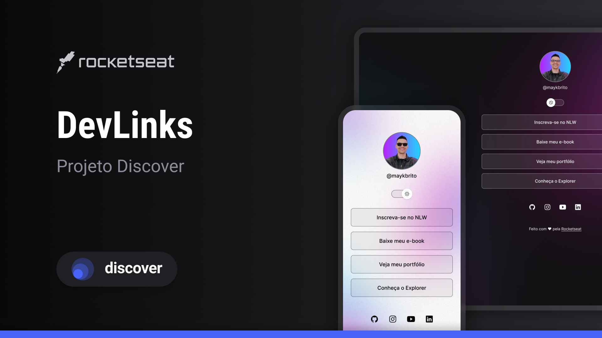

<h1 align="center"> Projeto DevLinks</h1>

Programa exclusivo e gratuito, promovido pela Rocketseat para ensino de tecnologias WEB.

  <a href="#-tecnologias">Tecnologias</a>&nbsp;&nbsp;&nbsp;|&nbsp;&nbsp;&nbsp;
  <a href="#-projeto">Projeto</a>&nbsp;&nbsp;&nbsp;|&nbsp;&nbsp;&nbsp;
  <a href="#-layout">Layout</a>&nbsp;&nbsp;&nbsp;|&nbsp;&nbsp;&nbsp;
  <a href="#memo-licença">Licença</a>

  

        

## 🚀 Tecnologias

Esse projeto foi desenvolvido com as seguintes tecnologias:

- HTML e CSS
- JavaScript
- Figma
- Git e Github

## 💻 Projeto

Proporciona a criação de um agregador de links para utilizar como cartão de visitas online.

## 🔖 Layout

Você pode visualizar o layout do projeto através [DESSE LINK](https://www.figma.com/file/IqxpEcb3C2z48k25ehUJaM/DevLinks-%E2%80%A2-Projeto-Discover-(Community)?type=design&node-id=1437-191&mode=design&t=vD2vP2hEhTcTkIF9-0). É necessário ter conta no [Figma](https://figma.com) para acessá-lo.

